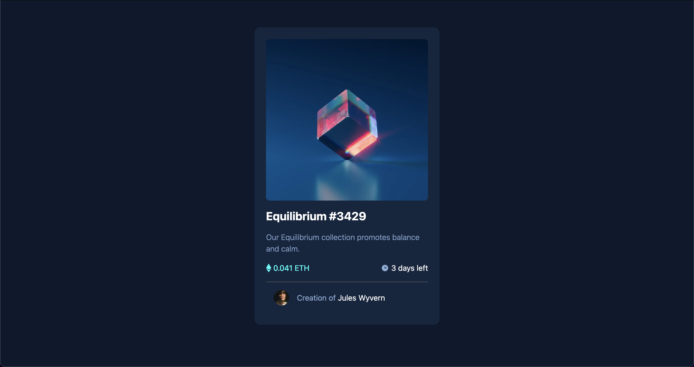

# Frontend Mentor - NFT preview card component solution

This is a solution to the [NFT preview card component challenge on Frontend Mentor](https://www.frontendmentor.io/challenges/nft-preview-card-component-SbdUL_w0U). Frontend Mentor challenges help you improve your coding skills by building realistic projects. 

## Overview

### The challenge

Users should be able to:

- View the optimal layout depending on their device's screen size
- See hover states for interactive elements

### Screenshot

### Links

- Live Site URL: [https://nft-card-preview.benjaminlee.dev/](https://nft-card-preview.benjaminlee.dev/)

### Built with

- Semantic HTML5 markup
- Flexbox
- Mobile-first workflow
- [React](https://reactjs.org/) - JS library
- [Tailwind](https://tailwindcss.com/) - For styles

## Author

- Github - [Benjamin Lee](https://github.com/BenjaminLee-boop)
- Frontend Mentor - [@@BenjaminLee-boop
](https://www.frontendmentor.io/profile/BenjaminLee-boop
)
